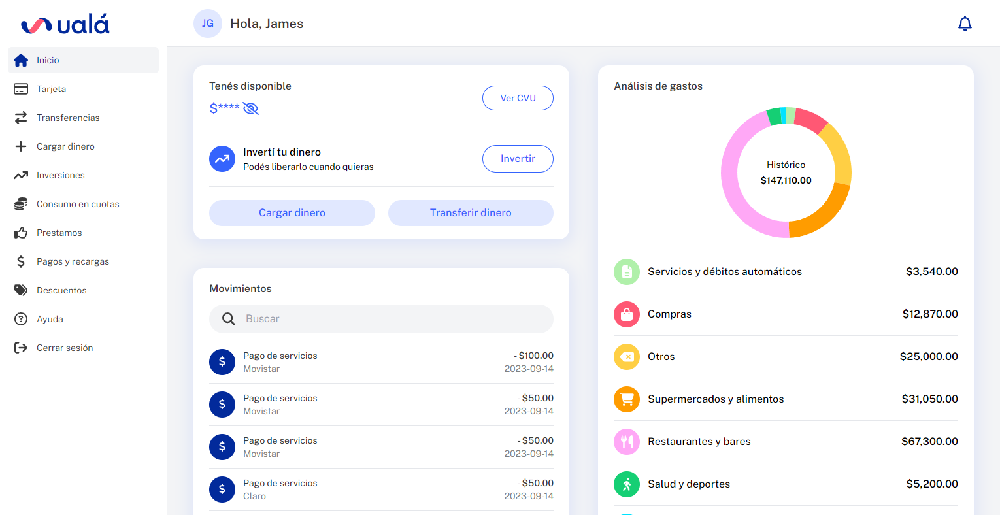

# s10-05-t-java-angular-uala

## Tecnologías:

| UX/UI | Frontend     | Backend          | Testing        |
| ----- | ------------ | ---------------- | -------------- |
| Figma | Angular      | Java Spring Boot | Selenium IDE   |
|       | Typescript   |                  | Jhenkins       |
|       | TailwindCSS  |                  | CorelDraw 21   |
|       | NGX Charts   |                  | Testing manual |

## Integrantes del grupo:

| Integrante          | Rol      | Contacto         |
| ------------------- | :------: | :--------------: |
| Karen Sánchez       | UX/UI    | [LinkedIn](https://www.linkedin.com/in/karensanchezg-2112/) |
| Elizabeth León      | UX/UI    | [LinkedIn](https://www.linkedin.com/in/elizabethleonperez/) - [Behance](https://www.behance.net/elizabethleonperez) |
| Federico Burgos     | Frontend | [GitHub](https://github.com/fedev95) - [LinkedIn](https://www.linkedin.com/in/federicoburgos/) |
| Pedro Saavedra      | Frontend |  |
| David Moreno Castilla | Frontend |[GitHub](https://github.com/davidjmcxl) - [LinkedIn](https://www.linkedin.com/in/davidjmc/) |
| Marcos Paz Goncheff | Backend  | [LinkedIn](https://www.linkedin.com/in/marcos-paz-goncheff/) |
| Marvin Archila      | Backend  | [LinkedIn](https://www.linkedin.com/in/marvin-david-archila/) |
| Dante Fontana       | Tester   | [LinkedIn](https://www.linkedin.com/in/maurifl/) - [Portfolio](https://my-portfolio-d7f82.firebaseapp.com/) |
| Ricardo Thalhuen Moraga Cortez | Tester   | [GitHub](https://github.com/Thalhuen) - [LinkedIn](https://www.linkedin.com/in/ricardothalhuen/) |

## Links
- [Figma](https://www.figma.com/file/DtT1Zgip6mBx1eDLsmjvJe/Ual%C3%A1?type=design&node-id=746-8209&mode=design&t=xuovkUgokDxbGPXC-0)
- [Live site](https://s10-05-t-java-angular-uala.web.app)
